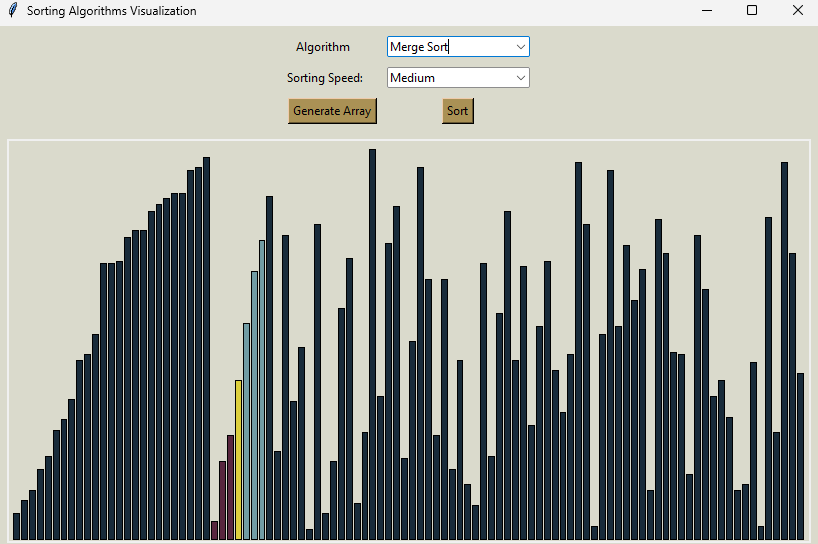

## Sorting Visualizer
This project is a Python-based application designed to visually demonstrate various sorting algorithms.



## How to Run the Project
```
Clone repository
    git clone https://github.com/yourusername/sorting-visualizer

Navigate to the Project Directory
    cd sorting-visualizer

Run 'main.py' from root
    python main.py
```

## Implemented Algorithms:
* Bubble Sort
* Merge Sort

## Technologies Used:
* Python3
* Tkinter
